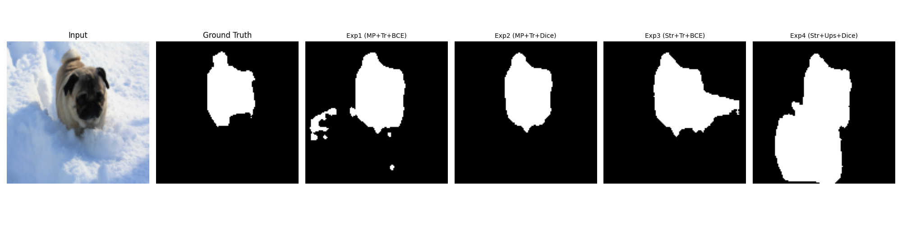

This is fantastic work. You have successfully implemented a modular U-Net from scratch, trained it with Mixed Precision, debugged a critical weight initialization error, and generated visual proof of learning.
# U-Net Segmentation from Scratch: Comparative Analysis


An implementation of the U-Net architecture for semantic segmentation, trained on the Oxford-IIIT Pet Dataset. This project implements a **modular Model Factory** to dynamically generate 4 distinct architectural variations to analyze the impact of downsampling strategies, upsampling methods, and loss functions.



## 🎯 Project Goals
The objective was to train a U-Net from scratch (no pre-trained weights) and benchmark four specific configurations:
1.  **Exp 1:** MaxPool + Transpose Conv + Binary Cross Entropy (BCE)
2.  **Exp 2:** MaxPool + Transpose Conv + Dice Loss
3.  **Exp 3:** Strided Conv + Transpose Conv + BCE
4.  **Exp 4:** Strided Conv + Upsampling + Dice Loss

## 🏗️ Engineering & Architecture

Instead of hardcoding four separate scripts, this repository uses a **Factory Pattern** to build models dynamically based on configuration.

### Key Features
*   **Modular U-Net Class**: The `UNet` class accepts `downsample_mode` ('mp' vs 'str_conv') and `upsample_mode` ('tr' vs 'ups') arguments to hot-swap layers during initialization.
*   **Custom Loss Functions**: Implemented `DiceLoss` from scratch and a weighted `BCEWithLogitsLoss` to handle class imbalance.
*   **Mixed Precision Training**: Utilized `torch.amp` (Automatic Mixed Precision) for faster training and lower memory usage on GPU.
*   **Production Logging**: Automated artifact saving (best weights, training history) for reproducibility.

## 📊 Experimental Results

All models were trained for 15 epochs on the Oxford-IIIT Pet Dataset (Pet vs Background).

| Experiment | Downsampling | Upsampling | Loss Function | Best Val Accuracy | Best Val Loss |
| :--- | :--- | :--- | :--- | :--- | :--- |
| **Exp 1** | Max Pooling | Transpose Conv | Weighted BCE | 93.45% | 0.2472 |
| **Exp 2** | Max Pooling | Transpose Conv | **Dice Loss** | **93.32%** | **0.1224** |
| **Exp 3** | Strided Conv | Transpose Conv | Weighted BCE | 91.60% | 0.2881 |
| **Exp 4** | Strided Conv | Upsampling | Dice Loss | 90.42% | 0.1762 |

### 🔍 Analysis & Observations

**1. The "Dice" Advantage (Exp 2 vs Exp 1)**
Experiment 2 (Dice Loss) achieved the lowest validation loss (0.122) and visually produced the cleanest masks.
*   *Insight:* In segmentation tasks where the background dominates the image (class imbalance), BCE can get "lazy" by predicting background. Dice Loss directly optimizes for the *overlap* of the pet shape, leading to sharper boundaries and faster convergence.

**2. MaxPool vs. Strided Convolution (Exp 2 vs Exp 4)**
Max Pooling (Exp 1 & 2) consistently outperformed Strided Convolutions (Exp 3 & 4) on this dataset.
*   *Insight:* While Strided Convolutions are "learnable" downsamplers, they add parameters and complexity. For a dataset of this size (~7k images), the translational invariance provided by Max Pooling proved more robust than trying to learn a custom downsampling filter.

**3. Transpose Conv vs. Upsampling**
Models using Transpose Convolution (Exp 1, 2, 3) produced smoother edges compared to Upsampling (Exp 4).
*   *Insight:* The Upsampling layer in Exp 4 (Nearest Neighbor) resulted in "blockier" predictions. Transpose Convolution allowed the network to learn how to smooth out artifacts during the upscaling process.

## 🚀 How to Run

### 1. Installation
```bash
pip install -r requirements.txt
```

### 2. Training
Run the automated experiment runner. This will download the data, process it, and train all 4 variations sequentially.
```bash
python scripts/train.py
```

### 3. Visualization
To generate the comparison images and verify predictions:
```bash
jupyter notebook notebooks/visualize_results.ipynb
```

## 📂 Repository Structure
```text
├── data/                  # Dataset storage
├── notebooks/             # Visualization & Analysis
├── results/               # Saved weights (.pth) and logs (.pkl)
├── src/
│   ├── dataset.py         # PyTorch Dataset & Preprocessing
│   ├── models.py          # U-Net Factory Architecture
│   └── trainer.py         # Training Utilities
├── scripts/
│   └── train.py           # Main Entry Point
└── README.md
```